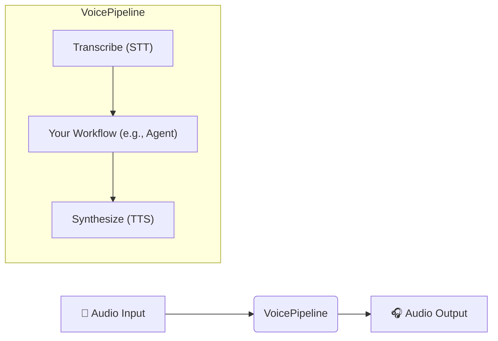

Okay, here is a comprehensive documentation file for the OpenAI Agents SDK version 0.0.7, generated based on the provided codebase (`repomix-output-openai-agents-python-main-0.0.7.zip.xml`). This document aims to be detailed and accurate, serving as a standalone guide for developers building autonomous agent systems with this SDK.

```markdown
# OpenAI Agents SDK v0.0.7 - Comprehensive Documentation

## Table of Contents

1.  [Introduction](#introduction)
    *   [Purpose](#purpose)
    *   [Core Concepts](#core-concepts)
    *   [Design Principles](#design-principles)
2.  [Getting Started](#getting-started)
    *   [Installation](#installation)
    *   [Configuration](#configuration)
    *   [Hello World Example](#hello-world-example)
3.  [Core Concepts Explained](#core-concepts-explained)
    *   [Agents (`Agent`)](#agents-agent)
        *   [Configuration Parameters](#configuration-parameters)
        *   [Dynamic Instructions](#dynamic-instructions)
        *   [Cloning Agents](#cloning-agents)
        *   [Agent Hooks (`AgentHooks`)](#agent-hooks-agenthooks)
    *   [Running Agents (`Runner`)](#running-agents-runner)
        *   [Execution Methods](#execution-methods)
        *   [The Agent Loop](#the-agent-loop)
        *   [Run Configuration (`RunConfig`)](#run-configuration-runconfig)
        *   [Handling Conversations](#handling-conversations)
        *   [Exceptions](#exceptions)
    *   [Results (`RunResult`, `RunResultStreaming`)](#results-runresult-runresultstreaming)
        *   [Accessing Output](#accessing-output)
        *   [Generated Items (`RunItem`)](#generated-items-runitem)
        *   [Raw Responses & Usage](#raw-responses--usage)
        *   [Input for Next Turn](#input-for-next-turn)
    *   [Tools (`Tool`)](#tools-tool)
        *   [Function Tools (`@function_tool`, `FunctionTool`)](#function-tools-function_tool-functiontool)
        *   [Hosted Tools (WebSearch, FileSearch, Computer)](#hosted-tools-websearch-filesearch-computer)
        *   [Agents as Tools (`Agent.as_tool`)](#agents-as-tools-agentastool)
        *   [Model Context Protocol (MCP) Support](#model-context-protocol-mcp-support)
        *   [Tool Use Behavior](#tool-use-behavior)
        *   [Error Handling in Tools](#error-handling-in-tools)
    *   [Handoffs (`Handoff`, `handoff()`)](#handoffs-handoff-handoff)
        *   [Defining Handoffs](#defining-handoffs)
        *   [Handoff Input (`input_type`, `on_handoff`)](#handoff-input-input_type-on_handoff)
        *   [Input Filters (`input_filter`)](#input-filters-input_filter)
        *   [Recommended Prompts](#recommended-prompts)
    *   [Context Management (`RunContextWrapper`)](#context-management-runcontextwrapper)
        *   [Defining and Using Context](#defining-and-using-context)
        *   [Local vs. LLM Context](#local-vs-llm-context)
    *   [Structured Output (`output_type`, `AgentOutputSchema`)](#structured-output-output_type-agentoutputschema)
        *   [Defining Output Types](#defining-output-types)
        *   [Validation](#validation)
        *   [Strict Schema](#strict-schema)
    *   [Guardrails (`InputGuardrail`, `OutputGuardrail`)](#guardrails-inputguardrail-outputguardrail)
        *   [Input Guardrails](#input-guardrails)
        *   [Output Guardrails](#output-guardrails)
        *   [Defining Guardrails (`@input_guardrail`, `@output_guardrail`)](#defining-guardrails-input_guardrail-output_guardrail)
        *   [Tripwires](#tripwires)
    *   [Streaming (`Runner.run_streamed`, `StreamEvent`)](#streaming-runnerrun_streamed-streamevent)
        *   [Consuming Events](#consuming-events)
        *   [Event Types](#event-types)
    *   [Models (`Model`, `ModelProvider`)](#models-model-modelprovider)
        *   [Interfaces](#interfaces)
        *   [Built-in OpenAI Providers](#built-in-openai-providers)
        *   [Using Custom Model Providers](#using-custom-model-providers)
        *   [Common Issues with Custom Providers](#common-issues-with-custom-providers)
    *   [Tracing (`trace`, `*_span`, `TracingProcessor`)](#tracing-trace-_span-tracingprocessor)
        *   [Automatic Tracing](#automatic-tracing)
        *   [Creating Traces and Spans](#creating-traces-and-spans)
        *   [Custom Processors & Exporters](#custom-processors--exporters)
        *   [Disabling Tracing](#disabling-tracing)
        *   [Sensitive Data](#sensitive-data)
    *   [Voice Capabilities (`VoicePipeline`)](#voice-capabilities-voicepipeline)
        *   [Overview](#overview)
        *   [Voice Workflow (`VoiceWorkflowBase`)](#voice-workflow-voiceworkflowbase)
        *   [Input and Output](#input-and-output)
        *   [Models (STT/TTS)](#models-stttts)
        *   [Configuration](#configuration-1)
4.  [Advanced Patterns](#advanced-patterns)
    *   [Multi-Agent Orchestration](#multi-agent-orchestration)
    *   [LLM-as-Judge](#llm-as-judge)
    *   [Parallelization](#parallelization)
    *   [Deterministic Flows](#deterministic-flows)
5.  [API Reference Summary](#api-reference-summary)
6.  [Examples](#examples)

---

## 1. Introduction

### Purpose
The OpenAI Agents SDK (v0.0.7) is a Python library designed for building multi-agent workflows and autonomous agent systems. It provides a lightweight yet powerful set of primitives to define, run, and coordinate AI agents equipped with tools and specific instructions.

### Core Concepts
The SDK revolves around a few key abstractions:

1.  **Agents:** The fundamental building blocks. An `Agent` encapsulates an LLM configuration, including its instructions (system prompt), the specific model to use, available tools, potential handoffs to other agents, and expected output structure.
2.  **Runner:** The mechanism (`Runner` class) for executing an agent or a sequence of agents. It manages the agent loop, tool calls, handoffs, and final output generation.
3.  **Tools:** Capabilities agents can use to interact with the outside world or perform specific tasks (e.g., function calls, web searches, file searches, computer actions).
4.  **Handoffs:** A specialized type of tool call that allows one agent to delegate the conversation or task to another, more specialized agent.
5.  **Guardrails:** Checks run alongside agent execution to validate inputs or outputs against predefined criteria, potentially halting execution if necessary.
6.  **Context:** A user-defined object passed through the agent run, available to tools, hooks, and guardrails for state management or dependency injection (but *not* directly visible to the LLM).
7.  **Tracing:** Built-in capability to record the detailed steps of an agent run (LLM calls, tool usage, handoffs) for debugging, monitoring, and optimization.

### Design Principles
*   **Minimal Abstraction:** Aims for a small set of core primitives, relying on Python for orchestration rather than complex internal state machines.
*   **Extensibility:** Designed to be easily extended with custom models, tools, and tracing processors.
*   **Python-First:** Leverages Python's features (decorators, type hints, async) for defining agent components.

---

## 2. Getting Started

### Installation

Ensure you have Python 3.9 or later.

```bash
# Create and activate a virtual environment (recommended)
python -m venv .venv
source .venv/bin/activate  # On Windows: .venv\Scripts\activate

# Install the SDK
pip install openai-agents==0.0.7

# Or, for voice capabilities:
pip install 'openai-agents[voice]==0.0.7'
```

### Configuration

The SDK primarily uses OpenAI models by default and requires an OpenAI API key.

1.  **Environment Variable (Recommended):**
    ```bash
    export OPENAI_API_KEY="sk-..."
    ```
2.  **Programmatic Configuration:** If you cannot set the environment variable, configure the key or client at runtime:
    ```python
    from agents import set_default_openai_key, set_default_openai_client, set_tracing_export_api_key
    from openai import AsyncOpenAI

    # Option 1: Set the default key (used for LLM calls and tracing by default)
    set_default_openai_key("sk-...")

    # Option 2: Set a specific key only for tracing uploads
    # set_tracing_export_api_key("sk-...")

    # Option 3: Provide a custom AsyncOpenAI client instance
    # custom_client = AsyncOpenAI(api_key="sk-...", ...)
    # set_default_openai_client(custom_client)
    ```
    See the [SDK Configuration](#sdk-configuration) section for more details.

### Hello World Example

```python
import asyncio
from agents import Agent, Runner

async def main():
    # Define an agent with a name and instructions
    agent = Agent(
        name="Haiku Assistant",
        instructions="You are a helpful assistant. Always respond in the form of a haiku.",
        model="gpt-4o-mini" # Example model
    )

    # Run the agent with user input
    user_input = "Tell me about the OpenAI Agents SDK."
    print(f"User: {user_input}")

    result = await Runner.run(agent, input=user_input)

    # Print the final output from the agent
    print(f"\nAgent: {result.final_output}")

if __name__ == "__main__":
    # Ensure OPENAI_API_KEY is set in your environment or configured programmatically
    import os
    if not os.getenv("OPENAI_API_KEY"):
        print("Error: OPENAI_API_KEY environment variable not set.")
    else:
        asyncio.run(main())

# Example Output:
# User: Tell me about the OpenAI Agents SDK.
#
# Agent: Code flows like water,
# Agents talk, tools do their work,
# Tasks are done with ease.
```

---

## 3. Core Concepts Explained

### Agents (`Agent`)

The `Agent` class is the central component. It represents an LLM configured for a specific purpose.

#### Configuration Parameters

```python
from agents import Agent, ModelSettings, Tool, Handoff, InputGuardrail, OutputGuardrail, AgentHooks
from typing import Any, Type

agent = Agent[TContext]( # Generic on context type TContext (defaults to Any)
    name: str,                      # Mandatory: Unique name for the agent.
    instructions: str | Callable | None = None, # System prompt or function to generate it.
    handoff_description: str | None = None, # Description used when this agent is a handoff target.
    model: str | Model | None = None, # Model name (str) or specific Model instance.
    model_settings: ModelSettings = ModelSettings(), # Temperature, top_p, tool_choice, etc.
    tools: list[Tool] = [],         # List of tools the agent can use.
    mcp_servers: list[MCPServer] = [], # List of MCP servers providing tools.
    handoffs: list[Agent | Handoff] = [], # Agents or Handoff objects this agent can delegate to.
    output_type: Type[Any] | None = None, # Expected structure of the final output (e.g., Pydantic model). None means str.
    input_guardrails: list[InputGuardrail] = [], # Guardrails to run on input (only for starting agent).
    output_guardrails: list[OutputGuardrail] = [],# Guardrails to run on final output.
    hooks: AgentHooks | None = None,   # Callbacks for agent-specific lifecycle events.
    tool_use_behavior: Literal["run_llm_again", "stop_on_first_tool"] | StopAtTools | ToolsToFinalOutputFunction = "run_llm_again", # How to handle tool results.
    reset_tool_choice: bool = True    # Whether to reset model_settings.tool_choice after a tool is used.
)
```

*   **`name`**: Identifies the agent, used in logging and tracing.
*   **`instructions`**: The core prompt defining the agent's persona, goals, constraints, and how it should use tools/handoffs. Can be static text or dynamic.
*   **`model`**: Specifies the LLM. Can be a string name (resolved by a `ModelProvider`) or a concrete `Model` instance (e.g., `OpenAIResponsesModel`, `OpenAIChatCompletionsModel`, or a custom one).
*   **`model_settings`**: Fine-tunes LLM behavior (temperature, `tool_choice`, `max_tokens`, etc.). See `ModelSettings` section.
*   **`tools`**: A list of `Tool` objects (`FunctionTool`, `WebSearchTool`, etc.) the agent can invoke.
*   **`mcp_servers`**: Integrates with external tool providers via the Model Context Protocol.
*   **`handoffs`**: Defines potential agents this agent can delegate to. Can be `Agent` instances directly or `Handoff` objects for more control.
*   **`output_type`**: If set (e.g., to a Pydantic model), instructs the LLM to produce structured JSON output matching that type. If `None`, the output is treated as plain text (`str`).
*   **`input_guardrails` / `output_guardrails`**: Lists of checks applied to input or final output.
*   **`hooks`**: For observing or reacting to this specific agent's lifecycle events.
*   **`tool_use_behavior`**: Controls what happens after a function tool is executed (run LLM again, stop immediately, custom logic).
*   **`reset_tool_choice`**: Prevents infinite tool-calling loops by resetting `model_settings.tool_choice` after a tool runs. Defaults to `True`.

#### Dynamic Instructions

Instead of a static string, `instructions` can be a function (sync or async) that receives the `RunContextWrapper` and the `Agent` instance, returning the system prompt string dynamically.

```python
from agents import Agent, RunContextWrapper

class MyContext:
    user_name: str

def get_dynamic_instructions(ctx: RunContextWrapper[MyContext], agent: Agent[MyContext]) -> str:
    return f"You are assisting {ctx.context.user_name}. Be friendly."

agent = Agent[MyContext](
    name="Personal Assistant",
    instructions=get_dynamic_instructions
)
```

#### Cloning Agents

Use the `.clone()` method to create a copy of an agent with modifications.

```python
pirate_agent = Agent(name="Base", instructions="Speak normally.")
robot_agent = pirate_agent.clone(name="Robot", instructions="Speak like a robot. Beep boop.")
```

#### Agent Hooks (`AgentHooks`)

Define a class inheriting from `AgentHooks[TContext]` and override methods like `on_start`, `on_end`, `on_handoff`, `on_tool_start`, `on_tool_end` to run custom code during specific agent lifecycle events. Assign an instance to `agent.hooks`.

```python
from agents import AgentHooks, Agent, RunContextWrapper, Tool
import logging

class MyAgentHooks(AgentHooks[None]):
    async def on_start(self, context: RunContextWrapper[None], agent: Agent[None]) -> None:
        logging.info(f"Agent {agent.name} starting.")
    async def on_tool_end(self, context: RunContextWrapper[None], agent: Agent[None], tool: Tool, result: str) -> None:
        logging.info(f"Agent {agent.name} used tool {tool.name}, got result: {result[:50]}...")

agent = Agent(name="Hooked Agent", hooks=MyAgentHooks())
```

---

### Running Agents (`Runner`)

The `Runner` class provides static methods to execute agent workflows.

#### Execution Methods

*   **`Runner.run(starting_agent, input, ..., max_turns, hooks, run_config) -> RunResult`**: Asynchronous execution. Runs the agent loop until completion or error. Returns a `RunResult` object containing the full history and final output.
*   **`Runner.run_sync(...) -> RunResult`**: Synchronous wrapper around `run()`. **Note:** Cannot be used in contexts with an existing event loop (e.g., FastAPI, Jupyter).
*   **`Runner.run_streamed(...) -> RunResultStreaming`**: Asynchronous execution in streaming mode. Returns a `RunResultStreaming` object immediately, which allows consuming events as they happen via its `stream_events()` method.

#### The Agent Loop

The `Runner` manages the interaction cycle:

1.  **LLM Call:** Invokes the current agent's model with the accumulated message history and configured tools/settings.
2.  **Response Processing:** Analyzes the LLM's response (`ModelResponse`).
3.  **Check for Final Output:**
    *   If `output_type` is set, checks if the response contains valid structured output matching the type.
    *   If `output_type` is `None` (plain text), checks if the response contains a message *without* any tool calls or handoffs pending execution.
    *   If a final output is found, run output guardrails and return/finish.
4.  **Check for Handoff:** If a handoff tool was called, update the current agent, apply input filters if any, run handoff hooks, and loop back to step 1.
5.  **Execute Tools:** If function or computer tools were called, execute them, run tool hooks, append the results to the history, and loop back to step 1. (Hosted tools like web search run server-side and their results are handled in step 3/4).
6.  **Turn Limit:** If `max_turns` is exceeded, raise `MaxTurnsExceeded`.

#### Run Configuration (`RunConfig`)

Passed to `Runner.run/run_streamed` to apply global settings across the entire run:

```python
from agents import RunConfig, ModelSettings, OpenAIProvider, HandoffInputFilter, InputGuardrail, OutputGuardrail
from agents.models import Model

config = RunConfig(
    model: str | Model | None = None,       # Global model override (name or instance).
    model_provider: ModelProvider = OpenAIProvider(), # Provider to resolve model names.
    model_settings: ModelSettings | None = None, # Global overrides for temp, top_p, etc.
    handoff_input_filter: HandoffInputFilter | None = None, # Default filter for handoffs.
    input_guardrails: list[InputGuardrail] | None = None, # Guardrails for the *initial* input.
    output_guardrails: list[OutputGuardrail] | None = None,# Guardrails for the *final* output.
    tracing_disabled: bool = False,         # Disable tracing for this run.
    trace_include_sensitive_data: bool = True, # Include input/output in traces.
    workflow_name: str = "Agent workflow",  # Name for tracing.
    trace_id: str | None = None,            # Custom trace ID.
    group_id: str | None = None,            # Group ID for linking traces.
    trace_metadata: dict[str, Any] | None = None # Custom metadata for trace.
)
```

#### Handling Conversations

Agent runs are typically single turns. To maintain a conversation:

1.  Run the agent with the user's first message.
2.  Get the `RunResult` (or await the `RunResultStreaming`).
3.  Use `result.to_input_list()` to get the full history including the agent's response and any intermediate steps (like tool calls/results).
4.  Append the next user message to this list.
5.  Call `Runner.run` again with the updated list as the `input` and potentially `result.last_agent` as the `starting_agent`.

```python
# Initial call
result1 = await Runner.run(agent, input="What is agent tracing?")
print(result1.final_output)

# Follow-up call
next_input_list = result1.to_input_list()
next_input_list.append({"role": "user", "content": "How do I disable it?"})
result2 = await Runner.run(result1.last_agent, input=next_input_list)
print(result2.final_output)
```

#### Exceptions

*   `MaxTurnsExceeded`: Raised if the agent loop exceeds `max_turns`.
*   `ModelBehaviorError`: Raised if the LLM produces invalid output (e.g., calls non-existent tool, malformed JSON for `output_type`).
*   `InputGuardrailTripwireTriggered`: Raised if an input guardrail's tripwire is activated.
*   `OutputGuardrailTripwireTriggered`: Raised if an output guardrail's tripwire is activated.
*   `UserError`: Raised for SDK configuration or usage mistakes.
*   Other exceptions from LLM APIs or tool functions may also propagate.

---

### Results (`RunResult`, `RunResultStreaming`)

These dataclasses hold the outcome of an agent run. `RunResultStreaming` is returned by `run_streamed` and provides access to events during execution, eventually populating the same fields as `RunResult`.

#### Accessing Output

*   **`result.final_output`**: Contains the final output produced by the *last* agent in the chain. Its type matches the `agent.output_type` (or `str` if `None`).
*   **`result.final_output_as(cls: Type[T], raise_if_incorrect_type: bool = False) -> T`**: Convenience method to cast `final_output` to a specific type `cls`. Use `raise_if_incorrect_type=True` for runtime checking.
*   **`result.last_agent`**: The `Agent` instance that produced the `final_output`. Useful for continuing conversations.

#### Generated Items (`RunItem`)

*   **`result.new_items`**: A list of `RunItem` objects generated *during the run* (excluding the initial input). These represent the steps taken.
*   **`RunItem` Types:**
    *   `MessageOutputItem`: A text or refusal message from the LLM. `raw_item` is `ResponseOutputMessage`.
    *   `ToolCallItem`: An LLM request to call a tool (function, web search, etc.). `raw_item` varies (e.g., `ResponseFunctionToolCall`).
    *   `ToolCallOutputItem`: The result of executing a local tool (function, computer). `raw_item` is `FunctionCallOutput` or `ComputerCallOutput`. Includes the Python `output` value.
    *   `HandoffCallItem`: A specific tool call requesting a handoff. `raw_item` is `ResponseFunctionToolCall`.
    *   `HandoffOutputItem`: Represents the confirmation that a handoff occurred. `raw_item` is effectively a `FunctionCallOutput`. Contains `source_agent` and `target_agent`.
    *   `ReasoningItem`: Reasoning steps from the model (if supported and returned). `raw_item` is `ResponseReasoningItem`.

#### Raw Responses & Usage

*   **`result.raw_responses`**: A list of `ModelResponse` objects, one for each LLM call made during the run. Each contains the raw `output` items from the model and `usage` statistics.
*   **`context_wrapper.usage`** (accessed within hooks/tools): Contains cumulative `Usage` (requests, tokens) for the run *up to that point*. `result.raw_responses` provides per-call usage.

#### Input for Next Turn

*   **`result.to_input_list() -> list[TResponseInputItem]`**: Combines the original `result.input` with the `result.new_items` (converted to input format) to create the complete message history, ready for the next turn in a conversation.

---

### Tools (`Tool`)

Tools define capabilities agents can use.

#### Function Tools (`@function_tool`, `FunctionTool`)

Wrap Python functions (sync or async) to make them callable by the agent.

```python
from agents import function_tool, RunContextWrapper

@function_tool #(name_override="...", description_override="...")
def my_tool(ctx: RunContextWrapper[MyContext], param1: str, param2: int = 5) -> str:
    """
    This is the tool description seen by the LLM.

    Args:
        param1: Description for param1 seen by LLM.
        param2: Description for param2 seen by LLM.
    """
    # Access context if needed: user_data = ctx.context.some_field
    # Perform action
    return f"Result: {param1}, {param2}"

# Add to agent:
agent = Agent(name="My Agent", tools=[my_tool])
```

*   **Decorator (`@function_tool`)**: Easiest way to create. Automatically generates name, description (from docstring), and parameter schema (from type hints).
*   **Schema Generation**: Uses Python's `inspect` and `griffe` (for docstrings) to build a JSON schema for parameters. Supports standard types, Pydantic models, TypedDicts, lists, optionals, etc. Docstring formats (google, numpy, sphinx) are auto-detected or can be specified.
*   **Context**: Tool functions can optionally accept `RunContextWrapper[TContext]` as their *first* argument to access run context.
*   **Strict Schema (`strict_mode=True`)**: By default, generated schemas enforce `additionalProperties: false` and make all non-defaulted parameters required, matching OpenAI's expectations for reliable tool use. Can be disabled with `strict_mode=False`.
*   **Manual Creation (`FunctionTool(...)`)**: Allows defining tools without a direct Python function, by providing name, description, schema, and an async `on_invoke_tool` callable manually.

#### Hosted Tools (WebSearch, FileSearch, Computer)

These tools are executed by the OpenAI backend when using the **Responses API**.

*   **`WebSearchTool(user_location=..., search_context_size=...)`**: Enables web search.
*   **`FileSearchTool(vector_store_ids=[...], max_num_results=..., include_search_results=...)`**: Enables retrieval from specified OpenAI vector stores.
*   **`ComputerTool(computer: Computer | AsyncComputer)`**: Enables screen interaction via a `Computer` or `AsyncComputer` implementation you provide (e.g., using Playwright). *Note: Requires `model="computer-use-preview"` and `model_settings=ModelSettings(truncation="auto")` on the agent.*

```python
from agents import Agent, WebSearchTool, FileSearchTool, ComputerTool, ModelSettings
# Assuming 'my_computer' is an instance of Computer or AsyncComputer
agent = Agent(
    name="Researcher",
    tools=[WebSearchTool(), FileSearchTool(vector_store_ids=["vs_123"])],
    # ComputerTool requires specific model and settings
    # model="computer-use-preview",
    # model_settings=ModelSettings(truncation="auto"),
    # tools=[ComputerTool(computer=my_computer)]
)
```

#### Agents as Tools (`Agent.as_tool`)

An agent can be wrapped as a function tool, allowing another agent to call it without handing over control completely.

```python
summarizer_agent = Agent(name="Summarizer", instructions="Summarize the input text.")
main_agent = Agent(
    name="Orchestrator",
    tools=[
        summarizer_agent.as_tool(
            tool_name="summarize_text",
            tool_description="Summarizes a given piece of text."
            # Optional: custom_output_extractor=async def(result: RunResult) -> str: ...
        )
    ]
)
```

#### Model Context Protocol (MCP) Support

Integrate external tool servers using the MCP standard.

*   **`MCPServerStdio` / `MCPServerSse`**: Classes to connect to MCP servers via stdio or HTTP SSE.
*   **`Agent(mcp_servers=[...])`**: Pass connected server instances to the agent. The SDK handles listing tools and invoking them.
*   **Caching**: Use `cache_tools_list=True` when creating the server if the tool list is static, improving performance.

```python
from agents import Agent
from agents.mcp import MCPServerStdio # Requires mcp library

# Assuming server is connected: `async with MCPServerStdio(...) as server:`
# agent = Agent(name="MCP Agent", mcp_servers=[server])
```

#### Tool Use Behavior

The `agent.tool_use_behavior` parameter controls the flow after a **function tool** runs:

*   `"run_llm_again"` (Default): Tool results are sent back to the LLM for a subsequent response.
*   `"stop_on_first_tool"`: The output of the *first* function tool called is immediately used as the agent's `final_output`. The LLM doesn't see the tool result.
*   `{"stop_at_tool_names": ["tool_a", "tool_b"]}`: If any listed tool is called, its output becomes the `final_output`.
*   `Callable[[RunContextWrapper, list[FunctionToolResult]], MaybeAwaitable[ToolsToFinalOutputResult]]`: A custom function to decide whether to stop or continue based on tool results.

#### Error Handling in Tools

*   **`@function_tool(failure_error_function=...)`**: Provide a function (`(ctx, error) -> str`) to generate a specific error message *sent back to the LLM* if the tool crashes.
*   **`@function_tool(failure_error_function=None)`**: If `None`, tool exceptions will propagate up and likely fail the entire `Runner.run` call.
*   **Default**: A generic error message is sent to the LLM.

---

### Handoffs (`Handoff`, `handoff()`)

Handoffs allow agents to delegate tasks or conversations to other agents. They are implemented as specialized function tools.

#### Defining Handoffs

Pass `Agent` instances or `Handoff` objects to `Agent(handoffs=[...])`.

```python
from agents import Agent, handoff, Handoff

billing_agent = Agent(name="Billing")
support_agent = Agent(name="Support")

triage_agent = Agent(
    name="Triage",
    handoffs=[
        billing_agent, # Simple case: SDK creates default Handoff
        handoff(        # Advanced case: Customize using handoff()
            agent=support_agent,
            tool_name_override="transfer_to_support_v2",
            tool_description_override="Escalate to the expert support agent.",
            # ... other options ...
        )
    ]
)
```

*   The SDK automatically creates a function tool for each handoff (e.g., `transfer_to_billing`).
*   The `handoff()` function provides more control over the tool name, description, input schema, and actions during the handoff.

#### Handoff Input (`input_type`, `on_handoff`)

Handoffs can optionally accept structured input from the calling LLM.

```python
from agents import Agent, handoff, RunContextWrapper
from pydantic import BaseModel

class EscalationInfo(BaseModel):
    reason: str
    priority: int

def log_escalation(ctx: RunContextWrapper, info: EscalationInfo):
    print(f"Escalating: {info.reason} (Priority: {info.priority})")

escalation_agent = Agent(name="Escalation")

triage_agent = Agent(
    name="Triage",
    handoffs=[
        handoff(
            agent=escalation_agent,
            input_type=EscalationInfo, # Define expected input structure
            on_handoff=log_escalation # Function called with context & validated input
        )
    ]
)
```

*   `input_type`: A type (like a Pydantic model) defining the expected arguments.
*   `on_handoff`: A function (sync or async) called *when the handoff occurs*. It receives the `RunContextWrapper` and, if `input_type` is set, the validated input data.

#### Input Filters (`input_filter`)

Control the message history passed to the next agent using `handoff(input_filter=...)`.

```python
from agents import Agent, handoff, HandoffInputData
from agents.extensions import handoff_filters # Common filters

def my_custom_filter(data: HandoffInputData) -> HandoffInputData:
    # Example: Keep only the last 2 messages from the combined history
    combined_history = list(data.input_history) + [item.to_input_item() for item in data.pre_handoff_items + data.new_items]
    filtered_history = tuple(combined_history[-2:])
    # Return new structure (can modify pre_handoff_items and new_items too)
    return HandoffInputData(input_history=filtered_history, pre_handoff_items=(), new_items=())

faq_agent = Agent(name="FAQ")
main_agent = Agent(
    name="Main",
    handoffs=[
        # Use a predefined filter
        handoff(agent=faq_agent, input_filter=handoff_filters.remove_all_tools),
        # Use a custom filter
        # handoff(agent=faq_agent, input_filter=my_custom_filter)
    ]
)
```

*   The filter function receives `HandoffInputData` (containing `input_history`, `pre_handoff_items`, `new_items`) and must return a `HandoffInputData` object.
*   Common filters are available in `agents.extensions.handoff_filters` (e.g., `remove_all_tools`).

#### Recommended Prompts

Include guidance in agent instructions on when and how to use handoffs. The SDK provides helpers:

```python
from agents import Agent
from agents.extensions.handoff_prompt import RECOMMENDED_PROMPT_PREFIX, prompt_with_handoff_instructions

agent = Agent(
    name="MyAgent",
    # Option 1: Add prefix manually
    # instructions=f"{RECOMMENDED_PROMPT_PREFIX}\nYour specific instructions here...",
    # Option 2: Use helper function
    instructions=prompt_with_handoff_instructions("Your specific instructions here..."),
    handoffs=[...]
)
```

---

### Context Management (`RunContextWrapper`)

Context provides a way to manage state and dependencies *locally* within your Python code during an agent run. **It is NOT automatically passed to the LLM.**

#### Defining and Using Context

1.  **Define a Context Class/Object:** Can be any Python object, often a `dataclass` or `pydantic.BaseModel`.
2.  **Type Hint Agents/Tools:** Use `Agent[MyContext]`, `RunContextWrapper[MyContext]` in tool function signatures.
3.  **Pass Context to Runner:** `Runner.run(..., context=my_context_instance)`.
4.  **Access Context:** Tool functions, hooks, guardrails, and dynamic instruction functions receive `RunContextWrapper` as their first argument. Access your object via `wrapper.context`.

```python
from dataclasses import dataclass
from agents import Agent, function_tool, Runner, RunContextWrapper

@dataclass
class UserSession:
    user_id: str
    request_count: int = 0

@function_tool
def increment_counter(ctx: RunContextWrapper[UserSession]) -> str:
    ctx.context.request_count += 1
    return f"Request count for {ctx.context.user_id} is now {ctx.context.request_count}"

# Type hint the agent
agent = Agent[UserSession](
    name="Counter",
    instructions="Use the tool to increment the counter.",
    tools=[increment_counter]
)

async def main():
    session = UserSession(user_id="user_123")
    result = await Runner.run(agent, input="Increment the counter.", context=session)
    print(result.final_output) # Agent's final message
    print(f"Final count in context: {session.request_count}") # Access updated context

# Output:
# Request count for user_123 is now 1
# Final count in context: 1
```

#### Local vs. LLM Context

*   **Local Context (`RunContextWrapper.context`)**: For your Python code (tools, hooks). Holds state, database connections, loggers, user info, etc. *Not sent to LLM.*
*   **LLM Context (Message History)**: The sequence of messages (`TResponseInputItem`) passed to the LLM. This is the *only* information the LLM sees directly. To provide information to the LLM, it must be included in:
    *   System instructions (`Agent.instructions`).
    *   The input message list passed to `Runner.run`.
    *   Tool descriptions or tool results.

---

### Structured Output (`output_type`, `AgentOutputSchema`)

Force the LLM to respond with a specific JSON structure instead of plain text.

#### Defining Output Types

Set `Agent(output_type=...)` using Pydantic models, TypedDicts, lists, etc.

```python
from pydantic import BaseModel, Field
from agents import Agent

class UserInfo(BaseModel):
    name: str = Field(description="User's full name")
    age: int | None = Field(None, description="User's age, if known")

agent = Agent(
    name="Extractor",
    instructions="Extract user information from the text.",
    output_type=UserInfo # Expect output matching this Pydantic model
)
```

#### Validation

*   When the LLM responds, the SDK uses `AgentOutputSchema` (which wraps Pydantic's `TypeAdapter`) to parse and validate the JSON string against the `output_type`.
*   `AgentOutputSchema.validate_json(json_str)`: Parses and validates. Returns the Python object or raises `ModelBehaviorError`.
*   The validated object is available as `result.final_output`.

#### Strict Schema

*   By default (`AgentOutputSchema(strict_json_schema=True)`), the JSON schema sent to the LLM enforces `additionalProperties: false` and makes all non-defaulted fields required. This improves the reliability of the LLM producing correct JSON. Can be disabled if needed.
*   `AgentOutputSchema.json_schema()`: Returns the generated (potentially strict) JSON schema.

---

### Guardrails (`InputGuardrail`, `OutputGuardrail`)

Run checks concurrently or sequentially with agent execution.

#### Input Guardrails

*   Defined in `Agent(input_guardrails=[...])` or `RunConfig(input_guardrails=[...])`.
*   Run only for the *first* turn of the *first* agent in a `Runner.run` call.
*   Receive the initial input and context.
*   Useful for input validation, policy checks, intent detection *before* the main agent runs.

#### Output Guardrails

*   Defined in `Agent(output_guardrails=[...])` or `RunConfig(output_guardrails=[...])`.
*   Run only when an agent produces a `final_output`.
*   Receive the final output, the agent producing it, and the context.
*   Useful for checking output safety, quality, or compliance.

#### Defining Guardrails (`@input_guardrail`, `@output_guardrail`)

Use decorators or manual instantiation:

```python
from agents import input_guardrail, GuardrailFunctionOutput, Agent, RunContextWrapper

@input_guardrail #(name="...")
def check_topic(ctx: RunContextWrapper, agent: Agent, input: str | list) -> GuardrailFunctionOutput:
    is_off_topic = "politics" in str(input).lower()
    return GuardrailFunctionOutput(
        output_info={"topic_check": "failed" if is_off_topic else "passed"},
        tripwire_triggered=is_off_topic
    )

# Add to agent:
# agent = Agent(name="MyAgent", input_guardrails=[check_topic])
```

#### Tripwires

*   If `GuardrailFunctionOutput.tripwire_triggered` is `True`:
    *   Execution halts immediately.
    *   `InputGuardrailTripwireTriggered` or `OutputGuardrailTripwireTriggered` is raised.
    *   The exception object contains the `GuardrailResult` with `output_info`.

---

### Streaming (`Runner.run_streamed`, `StreamEvent`)

Receive events as the agent run progresses.

#### Consuming Events

```python
from agents import Runner, Agent
from openai.types.responses import ResponseTextDeltaEvent

agent = Agent(name="Streamer", instructions="Count to three slowly.")
result_stream = Runner.run_streamed(agent, input="Count!")

async for event in result_stream.stream_events():
    if event.type == "raw_response_event":
        # Raw LLM stream events (e.g., token deltas)
        if event.data.type == "response.output_text.delta":
            print(event.data.delta, end="", flush=True)
    elif event.type == "run_item_stream_event":
        # Semantic events for new items (message, tool call, etc.)
        print(f"\n-- {event.name} --")
        # Access event.item (e.g., event.item.raw_item)
    elif event.type == "agent_updated_stream_event":
        print(f"\n-- Agent changed to: {event.new_agent.name} --")

# Access final state after stream is done
# print(result_stream.final_output)
```

#### Event Types

*   **`RawResponsesStreamEvent`**: Contains the raw `TResponseStreamEvent` directly from the underlying `Model.stream_response` call (e.g., token deltas, tool call chunks).
*   **`RunItemStreamEvent`**: Fired when a complete semantic item (`RunItem`) is processed by the `Runner`. `event.item` contains the completed `MessageOutputItem`, `ToolCallItem`, `ToolCallOutputItem`, `HandoffCallItem`, `HandoffOutputItem`, or `ReasoningItem`. `event.name` indicates the specific action (e.g., `"tool_called"`, `"message_output_created"`).
*   **`AgentUpdatedStreamEvent`**: Fired when a handoff occurs, indicating the `new_agent` that is now active.

---

### Models (`Model`, `ModelProvider`)

The SDK abstracts LLM interaction.

#### Interfaces

*   **`Model`**: Abstract base class for interacting with an LLM. Requires `get_response` (non-streaming) and `stream_response` methods.
*   **`ModelProvider`**: Abstract base class responsible for returning a concrete `Model` instance based on a model name string.

#### Built-in OpenAI Providers

*   **`OpenAIProvider`**: Default provider.
*   **`OpenAIResponsesModel`**: Implements `Model` using OpenAI's Responses API (default). Supports hosted tools.
*   **`OpenAIChatCompletionsModel`**: Implements `Model` using OpenAI's Chat Completions API. Does *not* support hosted tools but may be more compatible with other providers' APIs.

You can select the API via `set_default_openai_api("chat_completions" | "responses")` or by passing the specific model class instance to `Agent(model=...)`.

#### Using Custom Model Providers

Integrate non-OpenAI LLMs (like Google Gemini, Anthropic Claude, etc.) or local models.

1.  **Implement `Model`**: Create a class inheriting from `agents.models.interface.Model`. Implement `get_response` and `stream_response` using your target LLM's API client. This involves:
    *   Converting the SDK's input list (`list[TResponseInputItem]`) to your LLM's format.
    *   Converting the SDK's tools/handoffs (`list[Tool]`, `list[Handoff]`) to your LLM's function/tool calling format (including schema mapping).
    *   Mapping `ModelSettings` to your LLM's parameters.
    *   Calling your LLM's API.
    *   Converting your LLM's response (text, tool calls) back into the SDK's `ModelResponse` format (`list[TResponseOutputItem]`).
    *   Implementing the streaming conversion to yield `TResponseStreamEvent` objects compatible with the SDK's expectations (often mimicking the Chat Completions stream format).
2.  **Implement `ModelProvider`**: Create a class inheriting from `agents.models.interface.ModelProvider`. Implement `get_model(model_name)` to return an instance of your custom `Model`.
3.  **Configure Agent/Runner**:
    *   **Globally:** Use `set_default_openai_client()` with an OpenAI-compatible client pointing to your provider's endpoint (if available). May require `set_default_openai_api("chat_completions")`.
    *   **Per Run:** Pass your custom `ModelProvider` instance to `RunConfig(model_provider=...)`.
    *   **Per Agent:** Pass your custom `Model` instance directly to `Agent(model=...)`. This is often the most flexible.

#### Common Issues with Custom Providers
*   **Tracing:** Default tracing uploads to OpenAI. When using only custom providers, either disable tracing (`set_tracing_disabled(True)`), provide an OpenAI key just for tracing (`set_tracing_export_api_key`), or use a custom `TracingProcessor`.
*   **API Compatibility:** Most providers align with the Chat Completions API structure, not the Responses API. Ensure your custom `Model` implementation handles conversions correctly. Passing a concrete `Model` instance to `Agent` avoids issues with the global API setting.
*   **Structured Output/Tools:** Support varies. Some providers might not handle simultaneous tool use and forced JSON output (`response_schema`) in the same API call. In such cases, configure the API for tool use and rely on strong *prompting* to request JSON format, then use Pydantic for validation.

---

### Tracing (`trace`, `*_span`, `TracingProcessor`)

Record and visualize agent execution flows.

#### Automatic Tracing
By default, `Runner.run/run_streamed` calls are wrapped in a trace. Agent executions, LLM calls (`generation_span` or `response_span`), tool calls (`function_span`), handoffs (`handoff_span`), and guardrails (`guardrail_span`) automatically create spans within the current trace.

#### Creating Traces and Spans
*   **`trace(workflow_name, ..., disabled=False) -> Trace`**: Use as a context manager (`with trace(...)`) to group multiple `Runner` calls or custom logic into a single trace. Automatically handles start/finish and context management.
*   **`*_span(...) -> Span`**: Functions like `agent_span`, `function_span`, `custom_span`, etc., create specific span types. Use as context managers (`with agent_span(...)`) for automatic start/finish and nesting.
*   **`get_current_trace()` / `get_current_span()`**: Access the currently active trace or span (useful for manual parenting).

#### Custom Processors & Exporters
*   **`TracingProcessor`**: Interface for processing traces/spans (e.g., filtering, exporting).
*   **`TracingExporter`**: Interface for sending processed traces/spans to a destination (e.g., backend, console).
*   **`add_trace_processor(processor)`**: Add *another* processor (e.g., send to W&B *and* OpenAI).
*   **`set_trace_processors([processor1, ...])`**: *Replace* the default OpenAI processor with your own list.

#### Disabling Tracing
*   Globally: `agents.set_tracing_disabled(True)` or set env var `OPENAI_AGENTS_DISABLE_TRACING=1`.
*   Per Run: `RunConfig(tracing_disabled=True)`.
*   Per Trace/Span: `trace(..., disabled=True)` or `custom_span(..., disabled=True)`.

#### Sensitive Data
*   `RunConfig(trace_include_sensitive_data=False)`: Prevents LLM/tool inputs/outputs from being stored in traces.
*   Env Vars: `OPENAI_AGENTS_DONT_LOG_MODEL_DATA=1`, `OPENAI_AGENTS_DONT_LOG_TOOL_DATA=1` disable inclusion in *Python logs*, separate from trace data.

---

### Voice Capabilities (`VoicePipeline`)

Build voice-based agent interactions. *(Requires `openai-agents[voice]`)*

#### Overview
The `VoicePipeline` orchestrates Speech-to-Text (STT), your agent workflow, and Text-to-Speech (TTS).



#### Voice Workflow (`VoiceWorkflowBase`)
*   Abstract base class for the logic run between STT and TTS.
*   Implement `run(self, transcription: str) -> AsyncIterator[str]`. Receives transcription text, must yield text chunks for TTS.
*   **`SingleAgentVoiceWorkflow`**: A simple implementation that runs a single starting `Agent`, maintaining conversation history.

#### Input and Output
*   **`AudioInput`**: For static, pre-recorded audio buffers (`numpy` array).
*   **`StreamedAudioInput`**: For live audio streams; push chunks using `add_audio()`. Supports turn detection via STT model configuration.
*   **`StreamedAudioResult`**: Returned by `VoicePipeline.run()`. Use `result.stream()` to consume `VoiceStreamEvent`s (audio chunks, lifecycle events).

#### Models (STT/TTS)
*   Interfaces: `STTModel`, `TTSModel`, `VoiceModelProvider`.
*   Built-in: `OpenAIVoiceModelProvider`, `OpenAISTTModel`, `OpenAITTSModel`.
*   Configuration: `STTModelSettings`, `TTSModelSettings` (passed via `VoicePipelineConfig`).

#### Configuration
*   **`VoicePipelineConfig`**: Set `model_provider`, tracing options, STT/TTS settings (prompts, language, voice, buffering, turn detection).

---

## 4. Advanced Patterns

Refer to the `examples/agent_patterns` directory in the SDK for code examples of:

*   **Multi-Agent Orchestration:** Using LLM decisions (via tools/handoffs) vs. code-based control (chaining, loops).
*   **Deterministic Flows:** Chaining agents sequentially.
*   **LLM-as-Judge:** Using one agent to evaluate/critique another's output iteratively.
*   **Parallelization:** Running agents concurrently (e.g., using `asyncio.gather`).
*   **Routing:** Using a triage agent with handoffs.
*   **Agents as Tools:** Calling specialized agents via `Agent.as_tool`.

---

## 5. API Reference Summary

This document covers the primary functionalities. Key classes and functions include:

*   **Core:** `Agent`, `Runner`, `RunResult`, `RunResultStreaming`, `RunConfig`, `RunHooks`, `AgentHooks`, `RunContextWrapper`, `StreamEvent`.
*   **Tools:** `Tool`, `FunctionTool`, `@function_tool`, `WebSearchTool`, `FileSearchTool`, `ComputerTool`, `FunctionToolResult`, `ToolsToFinalOutputResult`.
*   **Handoffs:** `Handoff`, `handoff`, `HandoffInputData`.
*   **Models:** `Model`, `ModelProvider`, `ModelSettings`, `OpenAIProvider`, `OpenAIResponsesModel`, `OpenAIChatCompletionsModel`.
*   **Output:** `AgentOutputSchema`.
*   **Guardrails:** `InputGuardrail`, `OutputGuardrail`, `@input_guardrail`, `@output_guardrail`, `GuardrailFunctionOutput`.
*   **Items:** `RunItem`, `MessageOutputItem`, `ToolCallItem`, `ToolCallOutputItem`, `HandoffCallItem`, `HandoffOutputItem`, `ReasoningItem`, `ModelResponse`, `ItemHelpers`.
*   **Tracing:** `trace`, `*_span`, `TracingProcessor`, `add_trace_processor`, `set_trace_processors`, `set_tracing_disabled`.
*   **Voice:** `VoicePipeline`, `VoiceWorkflowBase`, `SingleAgentVoiceWorkflow`, `AudioInput`, `StreamedAudioInput`, `StreamedAudioResult`, `VoiceStreamEvent`, `STTModel`, `TTSModel`, `VoiceModelProvider`.
*   **Configuration:** `set_default_openai_key`, `set_default_openai_client`, `set_default_openai_api`, `enable_verbose_stdout_logging`.
*   **Exceptions:** `AgentsException`, `MaxTurnsExceeded`, `ModelBehaviorError`, `UserError`, `InputGuardrailTripwireTriggered`, `OutputGuardrailTripwireTriggered`.

---

## 6. Examples

The SDK includes numerous examples demonstrating various features and patterns. Refer to the `examples/` directory within the provided codebase (`repomix-output-openai-agents-python-main-0.0.7.zip.xml`) for practical implementations:

*   `examples/basic/`: Simple use cases like "Hello World", tools, streaming, dynamic prompts, lifecycle hooks.
*   `examples/agent_patterns/`: Demonstrations of patterns like routing, agents-as-tools, LLM-as-judge, parallelization, deterministic flows.
*   `examples/tools/`: Usage of hosted tools like WebSearch, FileSearch, ComputerUse.
*   `examples/handoffs/`: Examples focusing on handoff mechanisms and input filtering.
*   `examples/mcp/`: Integration with Model Context Protocol servers.
*   `examples/model_providers/`: How to configure and use non-OpenAI models.
*   `examples/voice/`: Demonstrations of static and streamed voice interactions.
*   `examples/customer_service/`, `examples/research_bot/`, `examples/financial_research_agent/`: More complete application examples.

---

This documentation provides a comprehensive overview based on the provided SDK version. Always refer to the specific code and official documentation for the most up-to-date details.
```